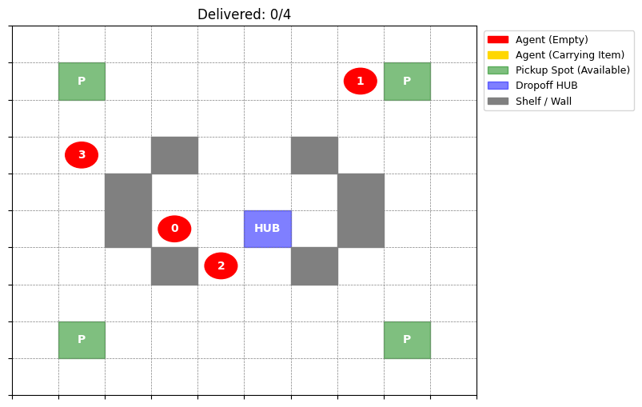

# Warehouse-Simulation: MARL Logistics Framework

**Warehouse-Simulation** is a high-agency Reinforcement Learning project designed to solve complex coordination and pathfinding problems in autonomous warehouse environments. Unlike projects that use pre-built libraries, this framework features a **custom-engineered 10x10 Gymnasium environment** built from first principles to model real-world logistics constraints.

---

## 🚀 Technical Highlights
* **Custom MARL Environment:** Architected a discrete-action grid world from scratch, incorporating static obstacles (shelves), dynamic pickup points, and a central delivery hub.
* **Algorithm Implementations:** Features both **Independent Q-Learning (Tabular)** and **Double Deep Q-Learning (DDQN)** with Experience Replay and Target Networks.
* **15D Observation Space:** Each agent processes a normalized 15-dimensional vector including its coordinates, inventory status, and 4-way proximity sensor encodings for collision avoidance.
* **Collision Mitigation:** Implemented a specialized reward function and "wait-state" logic to handle interdependent decision-making in a multi-agent system.

## 🧠 Environment Architecture
The simulation models a high-stakes logistics floor where agents must optimize throughput while maintaining strict safety protocols.

* **Agents (Red/Gold):** 4 independent robots navigating toward objectives.
* **Pickups (Green):** Dynamic locations that become unavailable once an item is retrieved.
* **Drop-off (Blue):** The central HUB where items are delivered to meet a system-wide quota.
* **Obstacles (Grey):** Static shelves that require agents to learn complex routing around bottlenecks.

## 🛠️ Technical Stack
* **Core:** Python, PyTorch, Gymnasium
* **Algorithms:** Independent Q-Learning, Double DQN (DDQN)
* **Visualization:** Matplotlib (Rendering & Animation), PettingZoo Simple Tag

## 📂 Project Structure
* `warehouse_sim.py`: The complete end-to-end framework including the custom Gymnasium environment, the Tabular Q-Learning baseline, and the Double Deep Q-Learning (DDQN) implementation.
* `initial_env.png`: High-fidelity visualization of the 10x10 warehouse grid and initial agent states.
* `multi_agent_q_tables.pkl`: Serialized model weights for instant greedy evaluation and pathfinding analysis.

---

### **Zero to One Deployment**
This project represents my ability to identify a complex systems problem and build the infrastructure to solve it. It moves beyond "AI wrappers" into the fundamental engineering of autonomous environments.

**Developer:** Shabad Singh Mathoun (Senior CS @ University at Buffalo)
